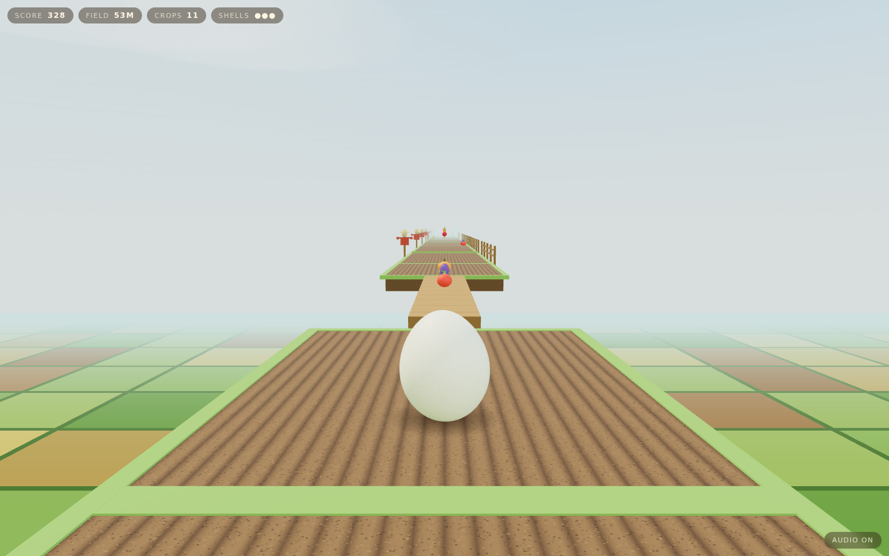
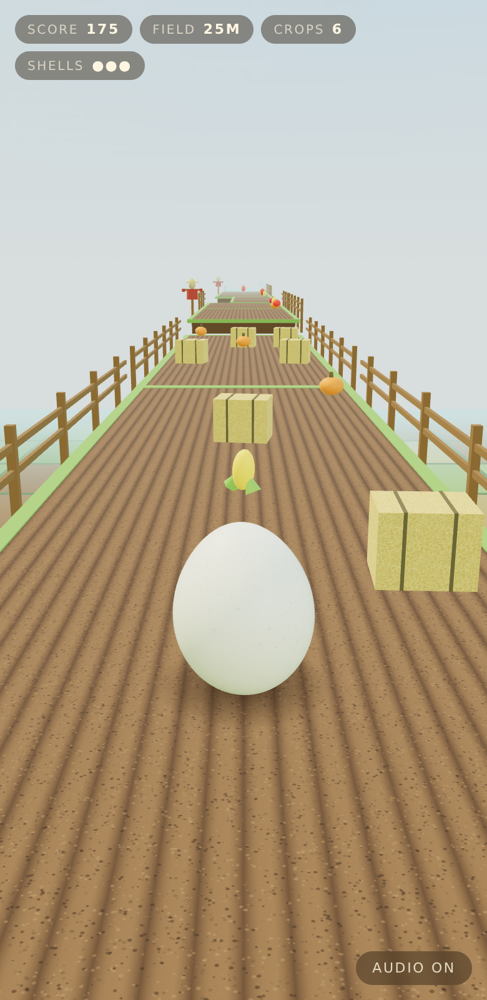

# Eggscape the Farm

The egg got out of the Matrix. What was on the other side of *that* was a
field.

A 3D runner-platformer in the browser: roll east down a farm that builds
itself, hop the ditches, weave the bales, pull up what is growing.

The egg is [Marc's](https://github.com/h1ddenpr0cess20/marc), as he is — the
same 128×96 shell through the same `shapeEgg` profile, the same 900-speckle
cream skin, the same physical material with its clearcoat and sheen. Nothing
was added to him for this and nothing was taken away. Everything else is new:
the world is lit rather than drawn in lines, the light is an afternoon, and
there is no screen between you and it.

He stays upright, too. The silhouette — fat end down, narrow end up — is the
asset, so he rocks and turns on the spot instead of tumbling end over end, and
the squash spring is allowed to flatten him but barely to stretch him.



## Run

```sh
git clone https://github.com/h1ddenpr0cess20/eggscape-ii
cd eggscape-ii
npm install
npm run dev               # → http://localhost:5173
```

No API keys, no server, no account. It is a static page and three.js. Every
surface on the farm — soil, grass, straw, board, sky — is painted onto a
canvas at boot, so there is nothing to download but the code.

## Play

| | |
|---|---|
| `A` `D` / `←` `→` | one furrow, per press |
| `W` / `↑` / `space` | hop — again in the air for a flip |
| `S` / `↓` | slam down — onto a bale to burst it |
| `M` | audio |

On a phone: swipe for a furrow, flick up to hop, flick down to slam, tap for a
hop.

Three shells. A bale costs one, so does going over the side, and either way the
egg is put back down and keeps going until the last one. A metre is a point, a
crop is twenty-five, and a bale you come down on — in the air, slam on — is
sixty and one fewer bale. Speed climbs with distance, so the farm gets harder
because you are getting faster, and the ditches widen to match.

The slam is the only move that answers back. Hop over a bale, put it on, and
the landing goes through the soil and takes the bale in that furrow with it —
your furrow only, and only a couple of metres of it, so it has to be aimed.

<p align="center">
  
</p>

## What is out there

Six things grow in the ground — carrot, corn, tomato, pumpkin, aubergine,
apple — and the course decides which grew where when it lays the plot, off its
own seeded stream. That is not decoration: the renderer keeps a pool of meshes
per kind and indexes straight into it, so a tomato is a tomato on every frame
and on every replay of that seed. Bales come round and square, and are picked
the same way.

The round one is stood on its end. Laid on its side it is a rounded box from
behind — the same silhouette as the square one, banded into pale rolls by its
own twine — and a hazard you cannot name at a glance is a hazard you do not
read in time.

Nothing beside the course can be touched. Fences, scarecrows and the quilt of
fields a long way below are all outside the furrows, where the egg cannot
reach them, because a fence you can run through is a lie and the only thing
in a furrow is a bale. What they can do is stand on something: every post is
driven down the face of the plot's own bank, since there is no ground out
there to plant it in.

## The soundtrack

There is no audio file in the repository, and there is music. `soundtrack.js`
writes it down — one token per sixteenth, `g2 - . g3+b3+d4` — and `music.js`
plays it on the same AudioContext the sound effects use, on instruments made
of oscillators and noise. Nothing is built until the page has had a touch,
because no browser will make a sound before one.

It is a hoedown: an upright bass on one and three, a mandolin chop on two and
four, a banjo rolling sixteenths over the both of them and a fiddle with the
tune, in G, round the oldest changes there are. The banjo is a Karplus–Strong
string — a burst of noise going round a delay line one period long, a little
duller every time round — made once at boot and played back faster or slower
for every other note, which also makes the high ones die sooner, the way a
real string's do.

The band turns up as you go. Bass, stomp and chop are there at the gate; the
banjo arrives at a hundred metres, the washboard and the fiddle at three
hundred, and at six hundred a second fiddle a third under the first and a barn
full of clapping. The second fiddle's part is not written down anywhere: it is
the first one moved two steps down the key, which is how the real one finds
it. A bale muffles the lot for a second. Between runs it is the porch before
the gate was open, a guitar picked slow and a harmonica and something in the
hedge — and going over the side for the last time is shave and a haircut, and
no two bits.

The sequencer never plays anything at the moment it is asked to. It puts
notes down a quarter of a second ahead on the audio clock, so a frame that
hitches is not a note that arrives late — and further ahead than that when the
frames are coming slowly, since a phone that is struggling is struggling on
every one of them. A tab that comes back from the background drops what it
missed and stays on the grid, rather than playing a minute of music at once.
`M` mutes it with everything else, and it keeps time while it is off, so it
comes back on the beat.

## How it holds together

The run is a plain object graph with no pixels in it — course, egg, lives,
score — and the renderer reads a snapshot of it every frame. Nothing in
`src/core/` imports three.js or touches the DOM, which is why a seed can be
played out headlessly in a test and asserted on.

```
index.html            Markup only — Vite's entry
src/
  main.js             The wiring, and nothing else
  styles.css          The HUD, and the sign between runs
  core/               The game. No three.js, no DOM, no randomness it did not seed
    game.js             Lives, score, crops, and real seconds → fixed ticks
    course.js           The farm, laid a plot at a time, ahead of the egg
    player.js           Gravity, furrows, hop, coyote time, landings
    tuning.js           Every number the run is tuned by — the course reads it too
    shape.js            Marc's egg profile, verbatim
    rng.js              A seeded stream, so a seed is a farm
    motion.js           The spring and the chase everything eases on
    emitter.js
  render/             three.js. Reads snapshots, owns no game state
    scene.js            Renderer, camera, haze, and the sky it hangs
    view.js             Snapshot → scene graph, and the chase camera
    rig.js              Where that camera sits and what it looks at, as arithmetic
    egg.js              Marc, fitted to the collider, and the smudge under him
    shell.js            His geometry and material, carried over as they are
    skin.js             His speckled cream, painted onto a canvas
    daylight.js         Sun, sky and bounce — his studio, taken outdoors
    props.js            Plots, bales, and the country under the farm
    produce.js          Six things growing, a builder each
    scenery.js          Fences and scarecrows, planted where they cannot be hit
    sky.js              The dome, painted on a canvas
    textures.js         Soil, grass, straw and board, painted on four more
    build.js            Boxes merged into one buffer, and uv tiling
    materials.js        Every surface on the farm, shared
    theme.js            The pigments, and what the produce is made of
  ui/
    hud.js              The readouts and the sign between runs
    input.js            Keys and swipes → one frame of intent
    sound.js            Four oscillators' worth of barn dance
    music.js            A sequencer that reads its parts out of strings
    soundtrack.js       A hoedown in G, and a porch for the title
    best.js             The only thing that survives a run
test/                 node:test, including an autopilot that proves seeds are fair
```

The generator never lays a ditch wider than the hop that has to clear it, or a
step higher than the hop can rise: both come out of the same `tuning.js` the
physics uses, and the tests check every seed against them. Plots never overlap
in z, so there is no wall to run into — miss a hop and you meet the ditch,
which is a fair thing to lose to.

One number in there is worth the warning it carries. `laneX` *descends* — lane
0 sits at the highest x — because the egg runs towards +z and the camera chases
it from behind, looking the same way, which mirrors the picture: world +x draws
on the left of the screen. Written the intuitive way round, every furrow
control is backwards and nothing in the core notices. `test/rig.test.js`
projects a furrow through the real rig and checks which half of the frame it
lands on, which is the only place the mistake is visible.

There is also an autopilot in `test/helpers/pilot.js`. It plays badly on
purpose — one frame of lookahead, no double hop — and the suite fails if it
cannot get a few hundred metres down a seed.

### The sky is a sphere, and that is deliberate

Handing an equirectangular texture to `scene.background` looks like the
cheapest possible sky and is not: three runs it through PMREM on the way in,
PMREM is a blur, and the blur dragged the clouds down into the haze and left a
bright seam lying across the horizon in every single frame. `sky.js` hangs the
canvas on a forty-triangle sphere the camera sits inside instead, which samples
it exactly as it was painted — and which leans when the camera leans, because a
backdrop that never moves is the thing that gives a backdrop away.

The band at the horizon is the same colour as the fog. That is what lets the
far end of the farm dissolve into the sky rather than stop dead against it, and
it is the reason the sky is mostly haze below the blue.

| Script | |
|---|---|
| `npm run dev` | Vite |
| `npm run build` | Bundles to `dist/` |
| `npm run preview` | Serves the build |
| `npm test` | `node:test` over the core, the box builder, the HUD, the page and the music |
| `npm run lint` | ESLint |

CI runs the lint, the tests on Node 22.12 and 24, and a build that then has to
boot and serve itself.
